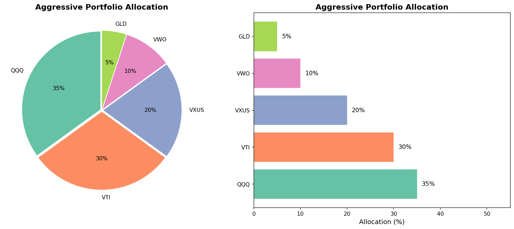

# ETF Model Portfolio Allocator

A Python-based tool to recommend ETF allocations tailored to investor risk profiles (Conservative, Balanced, Aggressive). Features automated CSV exports, bar/pie chart visualizations, and a complete data pipeline from API to output.


## Project Overview

This tool helps investors understand how to allocate their portfolio based on their risk tolerance:

- **User inputs** their risk profile and investment amount
- **Fetches live ETF data** from Yahoo Finance API (yfinance)
- **Calculates allocation** with dollar amounts
- **Visualizes** with pie and bar charts
- **Exports** results to CSV

## Tech Stack

| Tool | Purpose |
|------|---------|
| Python 3.13 | Core programming language |
| pandas | Data manipulation and analysis |
| yfinance | Yahoo Finance API for live ETF data |
| matplotlib | Data visualization (charts) |
| Jupyter Notebook | Interactive development environment |
| Git/GitHub | Version control |

## Project Structure
```
Portfolio-Builder-Project/
├── README.md
├── requirements.txt
├── .gitignore
├── notebooks/
│   └── 01_risk_profile.ipynb
└── output/
    ├── balanced_allocation.csv
    └── balanced_charts.png
```

## Quick Start

### 1. Clone the repository
```bash
git clone https://github.com/JHT1711/Portfolio-Builder-Project.git
cd Portfolio-Builder-Project
```

### 2. Create virtual environment
```bash
python3 -m venv venv
source venv/bin/activate  # Mac/Linux
```

### 3. Install dependencies
```bash
pip install -r requirements.txt
```

### 4. Run the notebook
```bash
jupyter notebook notebooks/01_risk_profile.ipynb
```

### 5. Follow the prompts
- Select risk profile (1, 2, or 3)
- Enter investment amount
- View your personalized allocation!

## Risk Profile Allocations

### Conservative (Low Risk)
| ETF | Allocation | Description |
|-----|------------|-------------|
| BND | 50% | Total Bond Market |
| VTIP | 20% | Treasury Inflation-Protected |
| VTI | 15% | US Total Stock Market |
| VXUS | 10% | International Stocks |
| GLD | 5% | Gold |

### Balanced (Medium Risk)
| ETF | Allocation | Description |
|-----|------------|-------------|
| SPY | 40% | S&P 500 |
| VTI | 30% | US Total Stock Market |
| BND | 20% | Total Bond Market |
| GLD | 10% | Gold |

### Aggressive (High Risk)
| ETF | Allocation | Description |
|-----|------------|-------------|
| QQQ | 35% | Nasdaq 100 |
| VTI | 30% | US Total Stock Market |
| VXUS | 20% | International Stocks |
| VWO | 10% | Emerging Markets |
| GLD | 5% | Gold |

## Sample Output



## Data Pipeline
```
User Input → yfinance API → pandas DataFrame → matplotlib Charts → CSV Export
```

## Skills Demonstrated

- **Python Programming** — functions, data structures, error handling
- **pandas** — DataFrames, data manipulation
- **yfinance** — API integration, live data fetching
- **matplotlib** — data visualization
- **Jupyter Notebooks** — interactive development
- **Git/GitHub** — version control

## Future Enhancements

- [ ] Custom portfolio weights
- [ ] Historical return/risk analysis
- [ ] Streamlit web dashboard
- [ ] Monte Carlo simulation
- [ ] Expense ratio comparison

## Author

**Jaikhush Thakkar**  
Double Major in Applied Statistics & Economics | Penn State University  
[GitHub](https://github.com/JHT1711) • [LinkedIn](https://www.linkedin.com/in/jaikhush-thakkar/)

---

*Disclaimer: This project is for educational purposes only and does not constitute financial advice.*
